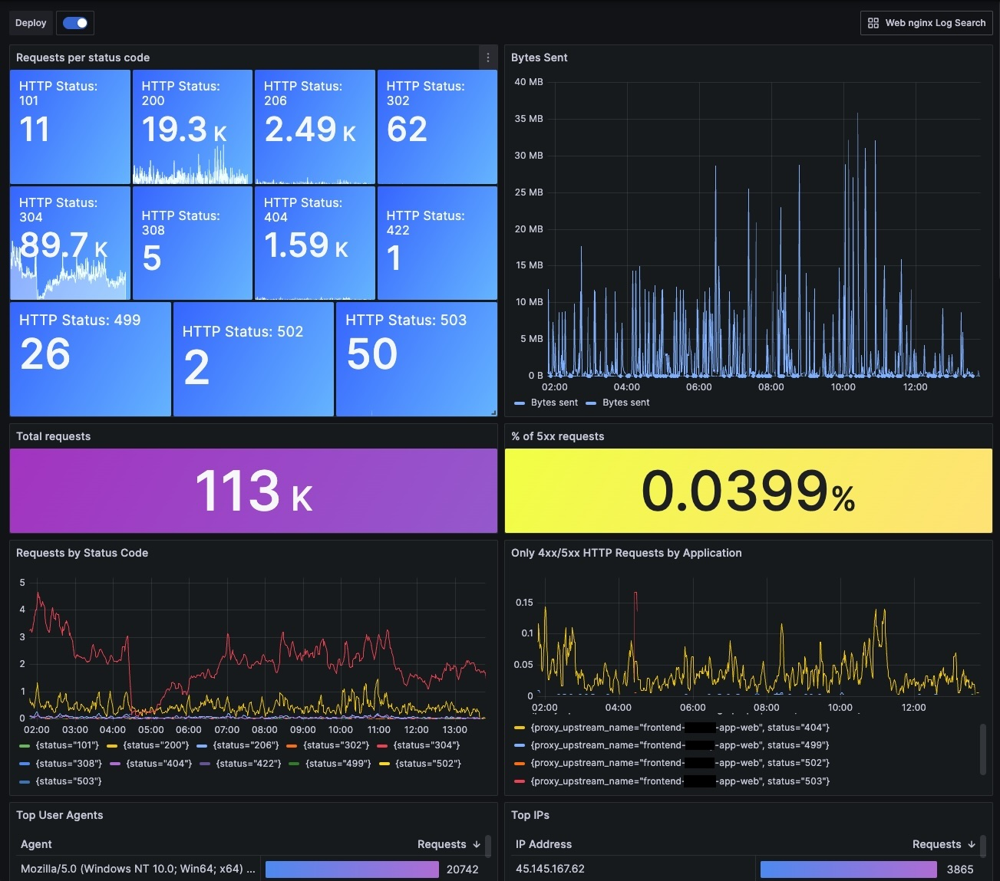
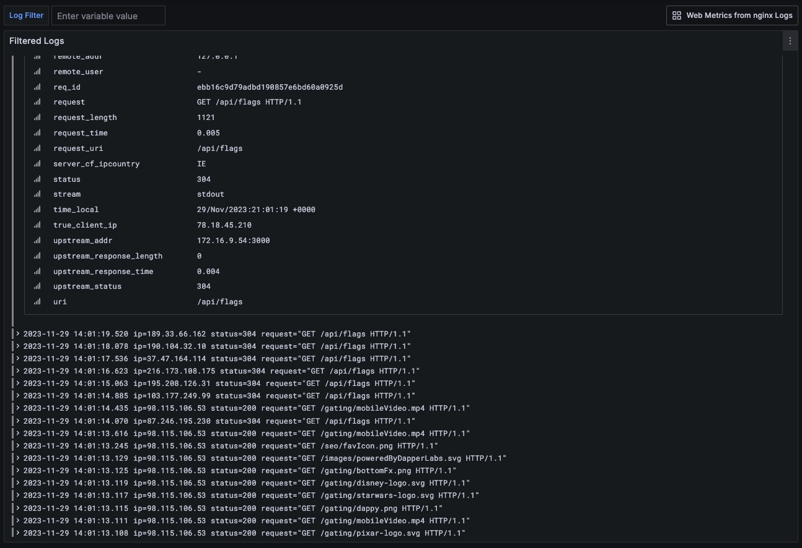

# terraform-nginx-ingress-loki-grafana-dashboards

This Terraform module helps to expose nginx metrics gathered by Loki as a Grafana Dashboard.

This can help to show your teams what traffic is actually hitting your endpoints.

NOTE: These dashboards were inspired by several other publically available dashboards and adjusted for this set.

## Requirements

| Name | Version |
|------|---------|
|  [grafana](#requirement\_grafana) | ~> 1.22 |

## Providers

| Name | Version |
|------|---------|
|  [grafana](#provider\_grafana) | 1.43.0 |
|  [random](#provider\_random) | 3.5.1 |

## Modules

No modules.

## Resources

| Name | Type |
|------|------|
| [grafana_dashboard.web_logs_dashboard](https://registry.terraform.io/providers/grafana/grafana/latest/docs/resources/dashboard) | resource |
| [grafana_dashboard.web_stats_dashboard](https://registry.terraform.io/providers/grafana/grafana/latest/docs/resources/dashboard) | resource |
| [random_string.random_logs](https://registry.terraform.io/providers/hashicorp/random/latest/docs/resources/string) | resource |
| [random_string.random_stats](https://registry.terraform.io/providers/hashicorp/random/latest/docs/resources/string) | resource |

## Inputs

| Name | Description | Type | Default | Required |
|------|-------------|------|---------|:--------:|
|  [app\_name](#input\_app\_name) | Application Name | `string` | `"nginx-ingress-controller"` | no |
|  [backend\_name](#input\_backend\_name) | Backend Name | `string` | `"backend-consumer-graphql-api-web"` | no |
|  [environment](#input\_environment) | Environment | `string` | n/a | yes |
|  [folder\_id](#input\_folder\_id) | Grafana Folder ID | `string` | n/a | yes |
|  [frontend\_name](#input\_frontend\_name) | Frontend Name | `string` | n/a | yes |
|  [loki\_datasource](#input\_loki\_datasource) | Loki Datasource | `string` | n/a | yes |
|  [notification\_channel](#input\_notification\_channel) | Notification Channel | `string` | n/a | yes |
|  [product\_name](#input\_product\_name) | Product Name | `string` | n/a | yes |
|  [service\_name](#input\_service\_name) | Service Name | `string` | n/a | yes |

## Outputs

No outputs.
